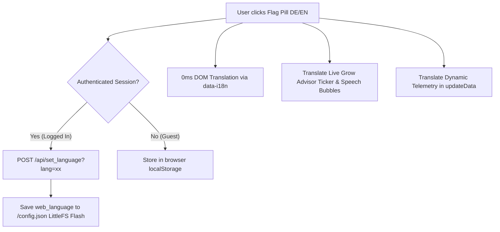

# Implementation Plan: Bilingual Web Interface (🇩🇪 DE / 🇺🇸 EN) & Authenticated Flash Persistence

Implement complete bilingual internationalization across the entire **iDRY-26 Web Application** (Dashboard, Modals, Info Bubbles, Settings, and OTA Firmware pages) with zero-latency client-side switching, platform-independent inline SVG flag icons, and permanent Flash memory persistence for authenticated sessions.

---

## Architecture Overview

---

## User Review & Design Decisions

- **Two Languages Standard:** Deutsch (🇩🇪 DE) and US English (🇺🇸 EN).
- **Inline SVG Flag Icons:** Avoids Windows monochrome emoji fallback (`DE DE` / `US EN`) by using crisp, colorful, lightweight inline SVG graphics (16x12px).
- **Flash vs. Session Storage:**
  - Guests/unauthenticated users have their language stored in `localStorage`.
  - Authenticated users automatically synchronize their choice to the ESP32's LittleFS Flash memory (`/config.json`) so newly connecting clients default to the configured language.

---

## Implemented Changes

### 1. Backend Core & Configuration (`src/main.cpp`)
- Added `char web_language[8] = "de";` to `struct Config`.
- Updated `loadConfiguration()` and `saveConfiguration()` to read and persist `web_language`.
- Added `web_language` to `/api/data` JSON telemetry payload.
- Added API endpoint `/api/set_language` (supporting `HTTP_POST` & `HTTP_GET`) guarded by `isWebAuthenticated()`.

### 2. High-DPI Inline SVG Glass Pill Header
- Standardized `.lang-pill` on:
  - **Dashboard Monitor (`/`)**
  - **Settings Management (`/settings`)**
  - **Firmware Update (`/firmware`)**
  - **GitHub Online OTA Terminal (`/firmware/autoupdate`)**
- Uses exact SVG vector definitions for Schwarz-Rot-Gold (🇩🇪) and Stars & Stripes (🇺🇸) with active Cyan-glow styling (`#38bdf8`).

### 3. Comprehensive Dictionary & Heuristics Translation
- Full dictionary mapping for:
  - All **Dashboard Cards**: Strategy buttons, Potentiometers, Rotor & Moon, Stoßlüftung Timer, Sensoren 1 & 2, Light Sensoren 1 & 2, VPD, ESP-NOW, MQTT, System Status.
  - All **14 Help Bubbles (`PANEL_INFOS_I18N`)**: Complete bilingual coverage (Indices 0–21).
  - All **Modals**: 24h Zoom Chart, VPD Day Confirm, Remote Reboot, Factory Reset.
  - **Grow Advisor Engine**: Dual-language payloads (`badgeDe`/`badgeEn`, `textDe`/`textEn`) for all heuristic diagnoses.
  - **Dynamic Telemetry (`updateData()`)**: Fixed overwrite edge cases for Potentiometers, Purge countdown, and connection status.

---

## Verification & Build Results

- **Compiler:** PlatformIO / ESP32-S3 (Arduino framework)
- **Build Milestone:** **v174** (17.4 release)
- **Result:** `[SUCCESS] Exit Code 0`
- **RAM Usage:** 29.7%
- **Flash Usage:** 22.7%
- **Firmware Binary Sync:** `FIRMWARE/firmware.bin` (v174) and `version.txt` auto-synchronized.
