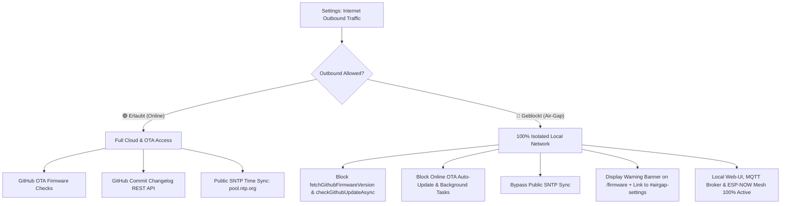

# Implementation Plan: Air-Gap Privacy Mode ("Paranoid Gardener Mode") [Build v182]

Implement an explicit Outbound Internet Traffic blocker (Air-Gap Mode) to guarantee 100% privacy for security-conscious users, featuring an interactive Visual Bridge UI card in Settings, safety confirmation popup dialog, transparent listing of all contacted endpoints, and strict suppression of GitHub OTA and public NTP requests.

---

## 1. Architectural Architecture & Privacy Flow

---

## 2. UI/UX Elements in Settings & Firmware

| Component | Location | Description & Visual Feedback |
| :--- | :--- | :--- |
| **Air-Gap Bridge Card** | `/settings#airgap-settings` | Slim, prominent card positioned directly below the Wi-Fi card with inline SVG House (Local) and Globe (Internet) icons. |
| **Dynamic Bridge Line** | Inside Air-Gap Card | Green glowing continuous pulse line (`.bridge-online`) when Online; red dashed cut line (`.bridge-blocked`) when Air-Gap is active. |
| **Status Pill** | Center of Bridge Line | `ONLINE` (Green badge) / `AIR-GAP` (Red badge). |
| **Safety Confirmation Modal** | `/settings` Popup | Warns user before enabling outbound traffic and transparently lists all contacted endpoints. |
| **Info Tooltip Button `ℹ` (idx 22)** | Air-Gap Card Header | Complete explanation of endpoints (`raw.githubusercontent.com`, `api.github.com`, `pool.ntp.org`, `time.google.com`, `time.nist.gov`). |
| **Air-Gap Firmware Notice** | `/firmware` | Warning banner with direct jump link `<a href="/settings#airgap-settings">` and suppression of client-side GitHub calls. |

---

## 3. Configuration & LittleFS Persistence

- `struct Config`: Added `int outbound_internet = 1;` (1 = Online, 0 = Air-Gap).
- Persisted in `/config.json` with CRC32 integrity checksum.
- Parsed and saved via `POST /settings/save`.

---

## 4. Verification & Build Results

- **Target:** ESP32-S3 DevKitC-1 N8
- **Milestone:** Build v182
- **Result:** Automated compilation verification via PlatformIO.
