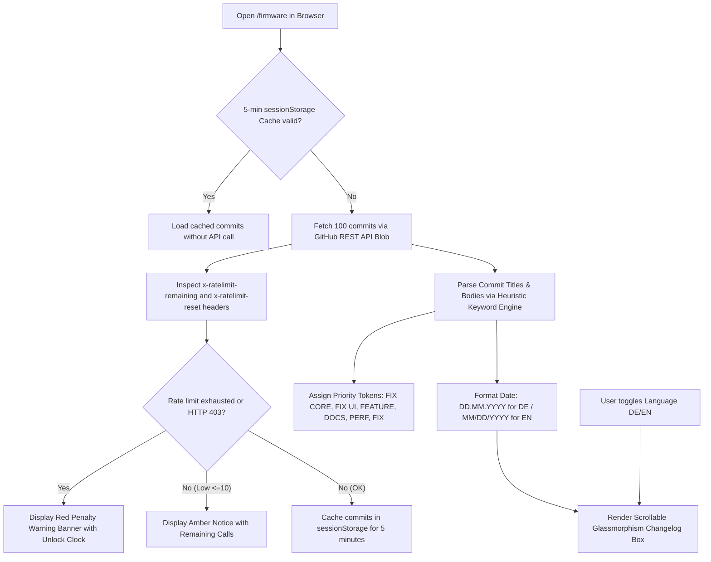

# Implementation Plan: Live GitHub Commit Changelog Feed & Rate-Limit Shield (Build v178)

Implement an automated client-side GitHub Commit Changelog feed on the **Firmware Update Page (`/firmware`)** inside the *VERSIONS-STATUS* panel with 100-commit full history blob fetching, sentence-wide keyword token analysis, 5-minute session caching to protect the 60/h quota, and rate-limit penalty warning banners.

---

## Architecture Overview

---

## Heuristic Keyword Recognition Priority

| Priority | Token / Badge | Trigger Keywords (Anywhere in Commit Message) | Badge Color |
| :---: | :--- | :--- | :--- |
| **1** | **`FIX CORE`** | `FIX_CORE`, `KERNEL`, `SENSOR`, `DRIVER`, `BME280`, `SHT31`, `TSL2561`, `ESPNOW`, `ESP-NOW`, `FAILSAFE`, `WATCHDOG`, `NVS`, `LITTLEFS`, `BOOT`, `EEPROM`, `SERVO` | 🔴 Rot (`#f87171` + Glow) |
| **2** | **`FIX UI`** | `FIX_UI`, `UI`, `WEB`, `HTML`, `CSS`, `DASHBOARD`, `SPARKLINE`, `MODAL`, `POPUP`, `DESIGN`, `FONT`, `FLAG`, `PILL`, `BANNER`, `LAYOUT`, `THEME`, `DROPDOWN`, `I18N`, `TRANSLAT` | 🟡 Amber (`#fbbf24`) |
| **3** | **`FEATURE`** | `FEATURE`, `FEAT`, `NEW`, `ADD`, `ADDED`, `IMPLEMENT`, `IMPLEMENTED`, `INTEGRATE`, `INTRODUCE`, `SUPPORT` | 🟢 Grün (`#34d399` + Glow) |
| **4** | **`DOCS`** | `DOCS`, `DOC`, `README`, `GUIDE`, `DOCUMENTATION`, `MANUAL`, `CHANGELOG`, `AGENTS` | 🔵 Cyan (`#38bdf8`) |
| **5** | **`PERF`** | `PERF`, `PERFORMANCE`, `REFACTOR`, `CLEANUP`, `OPTIMIZE`, `OPTIMIZED`, `SPEED`, `RAM_SAVING`, `MEM_SAVING` | 🟣 Lila (`#c084fc`) |
| **6** | **`FIX`** | `FIX`, `FIXED`, `BUG`, `PATCH`, `RESOLVE`, `RESOLVED`, `RESTORE`, `RESTORED`, `CORRECT`, `CORRECTED`, `HOTFIX`, `REPAIR` | 🌸 Rose (`#fb7185`) |
| **7** | **`FIX` (Default)** | *(kein spezifisches Schlüsselwort)* | ⚪ Schiefergrau (`#cbd5e1`) |

---

## Verification & Build Results

- **Compiler:** PlatformIO / ESP32-S3 (Arduino framework)
- **Build Milestone:** **v178**
- **Result:** `[SUCCESS] Exit Code 0` (Took 69.83s)
- **RAM Usage:** 29.7% (97,244 bytes)
- **Flash Usage:** 23.0% (1,564,957 bytes)
- **FIRMWARE Bundle:** Synchronized `FIRMWARE/firmware.bin` and `version.txt` (v178).
